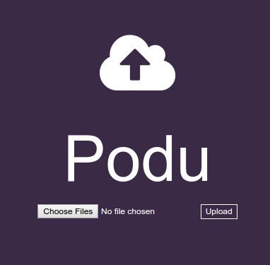
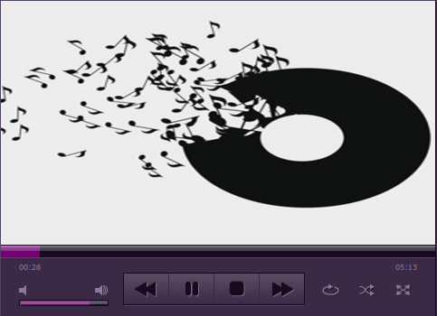

# Paatu Dabba
### Spend more time listening.

Paatu Dabba(பாட்டு டப்பா ) is Tamil for 'Song Box'. It aims to reduce time spent on copying songs between a group of people.

The application has three parts:

1. Podu (போடு, Tamil for 'Put') - upload your favourite audio files.
2. Paadu (பாடு, Tamil for 'Sing') - play your favourite audios.
3. Sudu (சுடு, Tamil slang for 'Steal') - download your favourite audios.

#### Requirements

* Flask
* eyeD3

#### Usage

1. Download the [zip file](https://github.com/astronomersiva/Paatu-Dabba/archive/master.zip).
2. Extract its contents in a directory of your choice.
3. Visit the directory and run `python views.py` in the terminal. This system now acts as the media server.
4. Visit the IP address of the server from any client(desktops, laptops, mobiles, etc.).
5. Get busy listening to music.

#### Screenshots

###### Home Page

###### Podu/Upload

###### Paadu/Play

#### Disclaimer

The contents of this repository are only for educational purposes. The maintainers of this repository are not responsible for your actions.

#### License

MIT © [Sivasubramanyam A](http://sivasubramanyam.me)
